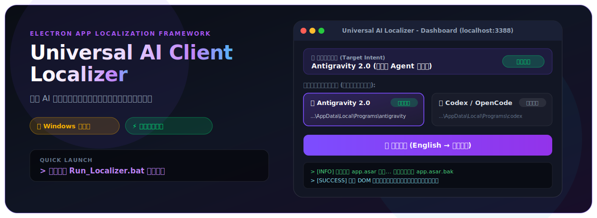

<p align="center">
  
</p>

<p align="center">
  <a href="https://github.com/SakitamAnler/Universal-AI-Client-Localizer"></a>
  <a href="https://github.com/SakitamAnler/Universal-AI-Client-Localizer"></a>
  <a href="https://nodejs.org/"></a>
  <a href="LICENSE"></a>
</p>

---

> [!IMPORTANT]
> **运行环境限制说明**：本工具当前专门针对 **Windows 操作系统** 进行深度适配与优化，请在 Windows 10 / 11 环境下直接运行 `Run_Localizer.bat`。

---

## 📌 简介 (Overview)

**Universal AI Client Localizer** 是一款专为 **Windows 平台** 打造的通用 AI 桌面客户端智能一键汉化与语言治理控制中心。

能够无缝感知、解剖并汉化包括 **Antigravity 2.0 (反重力 Agent 客户端)**、**Codex Desktop / OpenCode**、**Claude Desktop** 等在内的全系列 Electron 架构 AI 应用。系统集成了动态意图辨析、零延迟 Web 控制台、安全备份与秒级无损还原机制。

---

## ✨ 核心特性 (Key Features)

<table width="100%">
  <tr>
    <td width="50%" valign="top">
      <h3>🎯 智能意图感知 (Intent Engine)</h3>
      无论是默认路径还是自定义输入的任意 App 目录，系统均能通过解剖 <code>app.asar</code> 配置文件与二进制 Executable 特征，秒级辨别客户端类型并切入适配词库。
    </td>
    <td width="50%" valign="top">
      <h3>🔍 已安装客户端自动扫描</h3>
      轮询检测 Windows 默认安装目录下的 AI 客户端，在 Web 控制台生成可一键点击装载的小米超圆角（Squircle）深色卡片。
    </td>
  </tr>
  <tr>
    <td width="50%" valign="top">
      <h3>⚡ 无损 asar 重打包注入</h3>
      部署前自动创建安全备份 <code>app.asar.bak</code>，高效注入中文化补丁后快速重打包部署，支持随时秒级还原英文原版。
    </td>
    <td width="50%" valign="top">
      <h3>🌐 动态 DOM & Shadow DOM 拦截</h3>
      利用 <code>MutationObserver</code> 引擎实时拦截并中文化文本与属性（<code>placeholder</code>、<code>title</code> 等），同时对 Monaco 代码编辑区进行防篡改保护。
    </td>
  </tr>
</table>

---

## 🛠️ 适配客户端矩阵 (Supported Apps Matrix)

| 客户端名称 (Client Name) | 自动匹配识别特征 | 汉化适配状态 | 运行平台 |
| :--- | :--- | :---: | :---: |
| **Antigravity 2.0 (反重力 Agent 客户端)** | `Antigravity.exe` | ✅ 完全适配 | 🪟 Windows |
| **Codex Desktop / OpenCode** | `Codex.exe` / `OpenCode.exe` | ✅ 完全适配 | 🪟 Windows |
| **Claude Desktop** | `Claude.exe` | ✅ 完全适配 | 🪟 Windows |
| **Windsurf AI** | `Windsurf.exe` | ✅ 完全适配 | 🪟 Windows |

---

## 🚀 快速开始 (Quick Start for Windows)

### 仅需 3 步即可完成汉化：

1. **克隆 / 下载本仓库**到本地 Windows 系统：
   ```cmd
   git clone https://github.com/SakitamAnler/Universal-AI-Client-Localizer.git
   ```

2. **双击运行一键脚本**：
   直接双击运行根目录下的 **`Run_Localizer.bat`** 脚本。

3. **控制台图形化一键部署**：
   脚本会自动启动服务并在浏览器中打开控制面板 (`http://localhost:3388`)：
   - 点击感知到的客户端卡片；
   - 点击 **“一键汉化 (English → 简体中文)”** 按钮即可完成部署！

---

## 🛡️ 安全备份与一键还原 (Safety & Recovery)

- **秒级无损还原**：在控制面板随时点击 **“还原英文原版”** 按钮，系统将使用初始备份直接覆盖恢复。
- **进程占用防护**：汉化前自动提示并平滑关闭目标应用进程，避免文件锁定导致二进制损坏。


